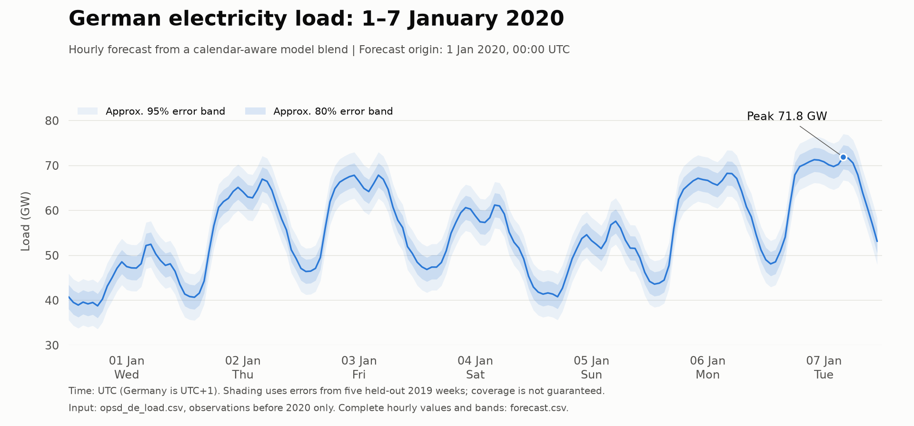

# German hourly electricity load forecast: 1–7 January 2020

## Deliverable

**[Hourly forecast CSV](outputs/forecast.csv)** contains all 168 hourly predictions, in MW, with German local timestamps and approximate 80% and 95% pointwise error bands.



| Date (UTC) | Mean load (GW) | Minimum hourly load (GW) | Maximum hourly load (GW) |
|---|---:|---:|---:|
| 1 Jan 2020 | 44.98 | 38.73 | 52.43 |
| 2 Jan 2020 | 56.58 | 40.64 | 66.94 |
| 3 Jan 2020 | 59.39 | 46.38 | 67.82 |
| 4 Jan 2020 | 54.02 | 45.34 | 61.17 |
| 5 Jan 2020 | 49.17 | 40.75 | 57.57 |
| 6 Jan 2020 | 59.61 | 43.57 | 68.23 |
| 7 Jan 2020 | 63.76 | 48.07 | 71.85 |

- Average load: **55.36 GW**.
- Total energy over the 168 hours: **9.300 TWh**.
- Highest forecast hour: **71.85 GW**, 7 January at **16:00 UTC / 17:00 CET**.
- Lowest forecast hour: **38.73 GW**, 1 January at **06:00 UTC / 07:00 CET**.

Load is average power during an hour. Multiplying each MW value by one hour and summing gives MWh, not MW. CSV values are rounded to 0.1 MW for numerical reproducibility, not to claim that level of predictive accuracy.

## Scope and assumptions

1. "First week" means the first seven calendar dates, **1 January 00:00 through 7 January 23:00 UTC**, not ISO week 1. UTC matches the input timestamps. This corresponds to 1 January 01:00 through 8 January 00:00 in Germany. A German-local midnight-to-midnight week would be shifted one hour earlier.
2. Treat this as a historical forecast issued at **1 January 2020, 00:00 UTC**, with observations through 31 December 2019, 23:00 UTC available. Actual publication delays and historical data revisions are not reconstructed.
3. The target is exactly `DE_load_actual_entsoe_transparency` in `opsd_de_load.csv`. Its values are assumed to be MW, following the OPSD/ENTSO-E load-column convention; the supplied file has no separate unit metadata. No adjustment to another definition of German demand is made.
4. The forecasting pipeline excludes all 2020 load values before numeric parsing, fitting, model selection, calibration, and target-period evaluation. The file checksum and initial input audit cover the complete input file; the audit checked coverage, missingness and value range, not target-period forecast performance. **No January 2020 actual-versus-forecast score was used or computed.**
5. No weather forecasts, realized 2020 temperatures, external demand series, or future observations are used.

## Input and causal data boundary

The pre-2020 history has **43,824** hourly observations from 1 January 2015 through 31 December 2019, with no duplicate timestamps, gaps, missing values, or nonpositive load values. The source file itself extends into 2020, so `load_history()` filters by cutoff before converting load values to numbers.

Every historical backtest has its own cutoff. Prediction features receive only observations strictly earlier than that cutoff. All load lags are at least 168 hours, allowing the entire week to be forecast in one batch without substituting actuals from inside the forecast window. Rolling means end at the target timestamp minus 168 hours. German civil time is used for calendar features, including daylight-saving changes; output remains in UTC.

Each fitted regression uses up to the last three years of observations. The January 2017 fold has only two years available because the history starts in 2015. Earlier observations remain available for annual lag features. No random train/test split is used.

## Models and selection

Five predefined candidates were compared:

- **Previous-week baseline:** use load from 168 hours earlier.
- **Annual weekday baseline:** use load from 364 days earlier, keeping the weekday aligned.
- **Calendar ridge regression:** hour-of-week profiles, annual Fourier terms, a linear trend, German nationwide holidays, Christmas Eve, New Year's Eve, a date-specific winter-break heuristic, and regional Epiphany effects. A median recent non-holiday residual adjusts the level.
- **Boosted trees:** calendar features, weekly and annual load lags, calendar features of the lagged hours, and lagged rolling means. This is scikit-learn histogram gradient boosting with fixed hyperparameters and no random early-stopping validation split.
- **50:50 blend:** equal weights on the ridge and tree forecasts.

The winter-break features are a heuristic, not official state-level school calendars. Epiphany on 6 January is a regional feature, not a nationwide public holiday.

### Rolling-origin selection results

Every fold forecasts 168 hours without updating on actuals from that week. Selection origins were 1 January in 2017, 2018, and 2019, plus 4 September, 2 October, and 23 October 2019.

The selection score was fixed as **75% of mean New Year MAE plus 25% of mean autumn MAE**, emphasizing the holiday regime relevant to this request. The fixed 50:50 blend had the lowest score.

| Candidate | New Year MAE (GW) | Autumn MAE (GW) | Weighted selection score (GW) |
|---|---:|---:|---:|
| Previous week | 7.824 | 1.999 | 6.367 |
| Annual weekday | 3.898 | 2.943 | 3.660 |
| Calendar ridge | 2.382 | 1.048 | 2.049 |
| Boosted trees | 2.412 | 1.166 | 2.101 |
| **50:50 blend** | **2.174** | **1.029** | **1.888** |

For the selected blend, mean absolute percentage error on those New Year weeks was **4.11%**. These are model-selection results, not an untouched estimate of January 2020 accuracy. Only three earlier New Year weeks were available for this comparison.

### Separate calibration and uncertainty

After choosing the model, five further 168-hour backtests were run with origins on **6 November, 20 November, 4 December, 18 December, and 25 December 2019**. Those windows were not used to select the model. Their pooled MAE was **1.708 GW** and MAPE **3.21%**. All their actuals precede 2020.

Absolute errors from these five weeks supply empirical pointwise bands:

- Approximate 80% band: forecast **±2.693 GW**.
- Approximate 95% band: forecast **±5.156 GW**.

These are the respective empirical quantiles of 840 absolute hourly errors, using the higher order statistic. The same width is used for every forecast hour. The bands are **not guaranteed prediction coverage**, do not jointly cover the whole week at the stated probability, and should not be summed to construct weekly-energy intervals. Errors are serially correlated, only five calibration weeks are available, and winter holidays or unusual temperatures can change the error distribution. Interval coverage has not been tested on an additional untouched period.

### Review diagnostic: the bands are optimistic around New Year

Applying the shipped widths to the earlier New Year backtest residuals covered only **67.9%** of hours with the nominal 80% band and **93.8%** with the nominal 95% band. These weeks helped select the model, so this is a regime diagnostic, not independent coverage validation. The nominal 80% band should not be interpreted as dependable 80% coverage for New Year.

Errors also persist across adjacent hours. The December 18 and December 25 calibration weeks were over-forecast by an average **2.882 GW** and **2.164 GW**, respectively. A coherent weekly bias can therefore matter much more for total energy than isolated hourly errors suggest. No weekly-energy confidence interval is claimed.

An independent Claude-peer review found no blocking leakage, calendar or output-arithmetic defects. Its findings and the orchestrator's evaluation are recorded in [review.md](outputs/review.md). The forecast values were not changed after review. In particular, no target-period actuals were consulted to tune the forecast or bands.

## Files

| File | Contents |
|---|---|
| `outputs/forecast.csv` | 168 forecasts, UTC and CET timestamps, approximate error bands |
| `outputs/forecast.png` | Hourly line chart with uncertainty shading |
| `outputs/daily_summary.csv` | UTC daily mean, minimum, maximum and energy |
| `outputs/model_selection.csv` | Candidate selection scores |
| `outputs/backtest_metrics.csv` | Per-origin MAE, RMSE and MAPE |
| `outputs/backtest_predictions.csv` | Historical fold predictions and actuals for reproducing scores |
| `outputs/metadata.json` | Cutoffs, selected model, assumptions, summary values and input SHA-256 |
| `forecast.py` | Data checks, calendar features, models, backtests and forecast export |
| `test_forecast.py` | Consumer, data-boundary, timestamp, holiday and output validation tests |
| `plot_forecast.py` | Chart rendering from the forecast CSV alone |
| `requirements.txt` | Exact dependency versions used |
| `forecast_run.log` | Completed forecasting run log |

## Reproduce

The successful run used **Python 3.14.6** and local packages installed under `.packages`. Virtual-environment creation encountered interpreter-access errors on this seat, so dependencies were not installed into a functioning virtual environment or into global Python.

```sh
python3 -m pip install --target .packages -r requirements.txt
PYTHONPATH=.packages OPENBLAS_NUM_THREADS=2 OMP_NUM_THREADS=2 python3 -m pytest -q test_forecast.py
PYTHONPATH=.packages OPENBLAS_NUM_THREADS=2 OMP_NUM_THREADS=2 python3 forecast.py
PYTHONPATH=.packages MPLCONFIGDIR=.matplotlib python3 plot_forecast.py
```

Run from this directory. In another environment, the same pinned packages may instead be installed into a conventional Python 3.14 virtual environment. `forecast.py` regenerates the `outputs` data files; `plot_forecast.py` regenerates the chart. The source input is never modified. Add `--print-texture` to the plotting command for a hatched print version.
