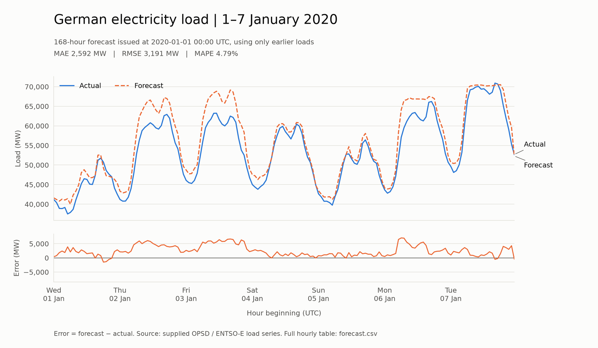

# German hourly electricity load forecast

`forecast_load.py` trains on the supplied historical load series and forecasts
all 168 hours from **2020-01-01 00:00 UTC through 2020-01-07 23:00 UTC**.
It then compares those frozen predictions with the actual values.

## Accuracy on the held-out week

Lower is better for all three error measures below.

| Method | MAE (MW) | RMSE (MW) | MAPE |
| :--- | ---: | ---: | ---: |
| **Gradient-boosted forecast** | **2,592.06** | **3,190.54** | **4.79%** |
| Repeat the previous week | 7,237.98 | 8,808.60 | 12.78% |
| Repeat the same weekday/hour 52 weeks earlier | 5,483.21 | 7,253.41 | 10.76% |

The model missed by **about 2.59 GW per hour on average**, or **4.79% of
actual load on average**. Its MAE was **64.19% lower** than the previous-week
baseline and **52.73% lower** than the 52-week baseline.

There was a clear upward bias: mean signed error was **+2,534.81 MW**
(forecast minus actual). The model tracked the daily cycle but generally
predicted too much demand, especially on January 2–3 and January 6. Those are
observations about the errors, not proof of a particular cause. MAPE is an
error percentage, not a classification-style percentage accuracy.



## Run it

Use Python 3.12. A populated `.venv312` environment was used for this run:

```bash
.venv312/bin/python forecast_load.py
```

To create an environment on another machine:

```bash
python3.12 -m venv .venv312
.venv312/bin/python -m pip install -r requirements.txt
.venv312/bin/python forecast_load.py
```

The script is headless, so no graphical desktop is required. Default paths
are relative to the script, not the shell's working directory. Optional paths:

```bash
.venv312/bin/python forecast_load.py \
  --data opsd_de_load.csv \
  --output-dir outputs
```

Running again replaces the generated files in the chosen output directory.
The CSV must have `utc_timestamp` and
`DE_load_actual_entsoe_transparency`, with load in MW. Missing or duplicate
hours, non-finite loads and non-positive loads are rejected rather than filled.

## How it works

Electricity demand has daily, weekly, annual and holiday patterns. The model
learns how those patterns change the relationship between historical loads
and future demand, without needing future observed loads.

- **Available history:** January 2015 through December 2019, 43,824 hourly
  observations. No missing hours or loads were found. The first 8,760 hours
  supply lag context; the fitted training labels run from January 2016 through
  December 2019, giving 35,064 training examples.
- **Features:** Berlin-local hour, weekday, weekend, month/day, annual sine and
  cosine, national German holidays, nearby holiday indicators, Epiphany,
  Christmas/New Year's Eve, and the year-end break. Load features are lags of
  168, 336, 8,736 and 8,760 hours plus trailing 24-hour and seven-day means,
  both shifted by 168 hours. The annual lags use fixed hours, not calendar-year
  offsets.
- **Historical model selection:** two predeclared histogram gradient boosting
  configurations, with 15 or 31 leaves, are compared on five separate
  seven-day holdouts beginning 2018-01-01, 2019-01-01, 2019-11-25,
  2019-12-09 and 2019-12-23. Each fit sees only observations before its own
  forecast origin. The candidate with lowest mean validation MAE is selected.
  Baselines are comparisons, not candidates. The selected 15-leaf model's
  mean validation MAE was 2,214.71 MW, versus 2,274.67 MW for 31 leaves.
- **Final fit:** the selected model is refitted on all eligible pre-2020
  history. It uses 200 boosting iterations, learning rate 0.07, minimum leaf
  size 30, L2 regularization 10 and random seed 42. Automatic early stopping
  is explicitly disabled, so it cannot create a random validation split.
- **Fixed forecast origin:** all seven days are forecast together. The most
  recent load any target feature can use is 2019-12-31 23:00 UTC. The model
  never updates using observed January loads. No target-week results were
  used to revise its configuration or features.
- **Evaluation:** each predicted hour is matched to that exact actual hour.
  MAE is mean absolute error; RMSE penalizes large misses more; MAPE is mean
  absolute percentage error. The JSON also reports WAPE and signed bias.
  Observations after January 7 are not used for fitting, selection or scoring.

## Assumptions and limits

1. **UTC defines the requested week**, matching the input's `utc_timestamp`.
   This is 01:00 CET on January 1 through 00:00 CET on January 8, not the
   midnight-to-midnight German-local week. Calendar features still use
   `Europe/Berlin`, including daylight saving time during training.
2. This is a **retrospective, no-target-leakage backtest**, not an archived
   forecast actually issued in 2020. It assumes all preceding hourly loads
   were available at the origin. Publication delays and historical revisions
   cannot be reconstructed from this CSV.
3. The previous-week baseline copies **December 25–31**, making it weak for
   this target. The 52-week baseline copies January 2–8, 2019, matching
   weekdays but not New Year's Day. Neither baseline is holiday-adjusted.
4. No weather or economic predictors are available in the supplied data.
   Epiphany is regional, not national; its feature and the other holiday
   indicators approximate aggregate effects without regional load weights.
5. This is one unusual winter holiday week. Its error does not establish
   typical year-round performance. Predictions are point estimates;
   uncertainty intervals have not been calibrated.
6. Source: the provided `opsd_de_load.csv`, identified by `AGENTS.md` as
   Open Power System Data's German ENTSO-E actual load series. No alternative
   data or target observations were downloaded. The input SHA-256 and package
   versions are recorded in `outputs/metrics.json`.

## Files

| File | Contents |
| :--- | :--- |
| `forecast_load.py` | Runnable training, selection, forecasting, plotting and scoring script |
| `outputs/forecast.csv` | All hourly actuals, forecasts, two baselines and errors |
| `outputs/forecast_vs_actual.png` | Actual/forecast comparison and signed-error panel |
| `outputs/forecast_vs_actual.svg` | Vector version of the same plot |
| `outputs/metrics.json` | Full-precision metrics, model settings, provenance and assumptions |
| `outputs/validation.csv` | Candidate and baseline scores for every historical fold |
| `outputs/daily_metrics.csv` | Errors separately for each of the seven UTC days |
| `test_forecast_load.py` | Consumer, boundary, missing-data, calendar and leakage tests |
| `PLAN.md` | The pre-implementation plan and independent plan challenge |

## Verification

```bash
.venv312/bin/python -m pip install -r requirements-dev.txt
.venv312/bin/python -m pytest -q test_forecast_load.py
.venv312/bin/python -m ruff check forecast_load.py test_forecast_load.py
.venv312/bin/python -m ruff format --check forecast_load.py test_forecast_load.py
.venv312/bin/python -m mypy --strict --ignore-missing-imports \
  --python-version 3.12 --cache-dir=/dev/null forecast_load.py test_forecast_load.py
```

The test suite includes an end-to-end check that replaces every 2020 load
with an extreme value: model selection and the saved forecasts must remain
unchanged. That test reduces boosting iterations for speed; the delivered
forecast uses the full settings above. Strict typing checks our code while
allowing untyped third-party imports and two untyped matplotlib date helpers.
The cache option avoids a mypy SQLite-cache error in the execution environment.
