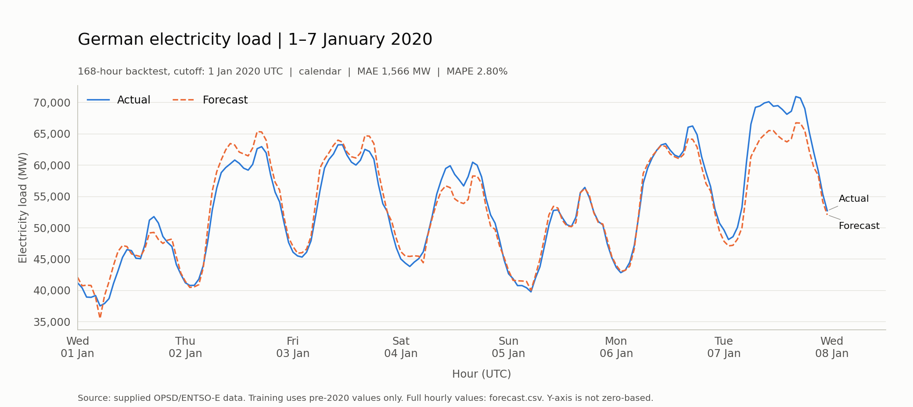

# German hourly electricity-load forecast

`forecast_load.py` trains on historical German load, forecasts all 168 hours
of 1–7 January 2020 in one batch, and evaluates against the supplied actuals.
It reads `opsd_de_load.csv` with pandas and plots with matplotlib. Nothing is
fetched from the network when the script runs.

## Run

From this directory, use the existing project environment:

```bash
../../.venv/bin/python forecast_load.py
../../.venv/bin/python -m pytest -q test_forecast_load.py
```

For a separate installation, use Python 3.12 and install `requirements.txt`
into a virtual environment, then run:

```bash
python -m pip install -r requirements.txt
python forecast_load.py --input opsd_de_load.csv --output-dir outputs
python -m pytest -q test_forecast_load.py
```

The default input and output paths are relative to the script, not the working
directory. Explicit relative CLI paths are relative to the working directory.
A run fits both variants on each validation week and refits the winner, so allow
roughly two minutes on this machine. Re-running replaces the generated files in
the chosen output directory. The original data is never modified.

## Results on the held-out week

| Metric | Selected forecast | Previous-week baseline |
| :--- | ---: | ---: |
| MAE | 1,566.41 MW | 7,237.98 MW |
| RMSE | 2,050.95 MW | 8,808.60 MW |
| MAPE | 2.80% | 12.78% |
| WAPE | 2.93% | 13.55% |
| Mean signed error | -215.08 MW | -6,908.52 MW |

The selected model is a **calendar-only histogram gradient-boosted tree
regressor**. In plain language, it learns how load changes with the hour,
weekday, season and holiday calendar, including the Christmas/New Year period.
It learns combinations of those effects, not just a single average daily curve.

Its average absolute miss was about **1.57 GW**, or **2.80% of actual load**
when averaged hour by hour. MAPE is an error measure, not a claim that the
forecast is "97.20% accurate". Negative signed error means underprediction.
MAE was 78.36% lower than repeating the previous week, although Christmas makes
that baseline particularly weak here.

The plot captures the daily rises and falls. The largest daily error was on
January 7, when the model underpredicted by an average of 3,445 MW. These are
results for one week, not evidence of year-round accuracy.



## Forecast protocol and assumptions

- **Time boundary:** 2020-01-01 00:00 through 2020-01-07 23:00 **UTC**, inclusive.
  UTC is the explicit assumption because the source column is `utc_timestamp`.
  This differs by one hour from a week defined at German local midnight.
  Calendar features use `Europe/Berlin`, including daylight-saving changes.
- **Data audit:** the input has 50,400 complete hourly records from 2015-01-01
  through 2020-09-30. There are no missing hours, duplicates, missing loads,
  nonfinite loads or nonpositive loads. The script rejects these problems
  rather than silently interpolating or dropping evaluation hours.
- **History:** 43,824 hourly observations precede the forecast origin. Both
  variants reserve the first 8,760 hours as lag warm-up so they fit on identical
  rows. The final selected model fits 35,064 observations from 2016-01-01
  through 2019-12-31; 2015 supplies historical lag context for the alternative.
- **Variants:** calendar-only versus the same calendar features plus loads
  168, 336, 8,736 and 8,760 hours earlier. These represent one week, two weeks,
  364 days and 365 days. The last two provide different annual alignments;
  the 365-day match is not universally a same-date match around leap years.
- **Selection:** expanding-history validation at five fixed origins:
  2018-01-01, 2019-01-01, 2019-11-04, 2019-12-02 and 2019-12-23. Each model
  predicts a whole 168-hour week using only observations preceding that origin.
  Hyperparameters and these folds were fixed before examining the test result.
  The lowest mean validation MAE wins; each week has equal weight.
- **Pre-test comparison:** mean validation MAE was 1,690.44 MW for calendar-only
  and 1,968.53 MW for calendar-plus-lags. The selected model is then refitted
  on the eligible pre-2020 history. No model changes were made in response to
  January 2020 accuracy.
- **No rolling updates:** the forecast receives no actual load from within the
  requested week. Every candidate lag is at least the entire forecast horizon.
  The fitting API rejects history that overlaps the forecast or ends too early.
- **Reproducibility:** fixed seed, fixed tree parameters, no random early-stopping
  split, recorded dependency versions, and an input SHA-256 digest. The output
  JSON records fitted date bounds, row counts and every validation result.

## Metric definitions

For actual load `y`, predicted load `p`, and `e = p - y`:

- MAE = mean of `abs(e)` in MW.
- RMSE = square root of mean `e**2`, in MW; large misses count more heavily.
- MAPE = `100 * mean(abs(e) / y)`.
- WAPE = `100 * sum(abs(e)) / sum(abs(y))`.
- Bias = `mean(e)` in MW; positive means overprediction.

## Generated files

| File | Contents |
| :--- | :--- |
| `outputs/forecast.csv` | All 168 timestamps, actuals, forecasts, baseline and hourly errors |
| `outputs/forecast.png` | Actual versus forecast, with distinct colors and line styles |
| `outputs/forecast.svg` | Scalable version of the same chart |
| `outputs/metrics.json` | Metrics, selection evidence, model settings, data audit and versions |
| `outputs/validation.csv` | Scores and training sizes for each historical validation fold |
| `outputs/daily_metrics.csv` | Accuracy for each of the seven UTC days |

## Limits and verification

This is a retrospective fixed-origin backtest on the supplied data, not a claim
that this forecast was actually issued in 2019. Publication delays and subsequent
revisions to historical load are not available in the input. No weather forecasts,
industrial schedules or uncertainty intervals are used. National holidays and
January 6 are explicit features; other regional holidays are not explicitly modeled.

The tests cover the exact forecast window, metric formulas, local calendar
conversion, lag availability, invalid input, overlapping validation, and held-out
value mutation. The end-to-end test runs the CLI from a different directory,
checks every actual and baseline hour against the original CSV, independently
recomputes metrics with standard-library arithmetic, and checks generated files.

Verification: **17 tests passed**, including the full CLI run. Ruff lint and
format checks passed. The scoped strict mypy check passed with the third-party
typing exclusions documented in `REVIEW.md`.

The plot palette passed its contrast and color-vision checks, and the rendered
PNG was visually inspected. See `REVIEW.md` for the independent plan review,
its dispositions, and the final peer-review availability limitation.
