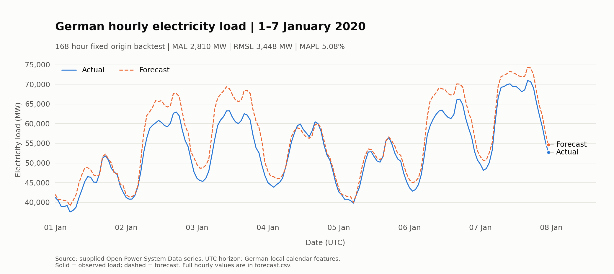

# German hourly electricity load forecast

`forecast_load.py` trains on the supplied `opsd_de_load.csv`, produces all
168 predictions for 1–7 January 2020, evaluates against actual load, and
writes a matplotlib comparison plot plus machine-readable results.

## Run

With the existing project environment, from this directory:

```bash
../../.venv/bin/python forecast_load.py
```

For a separate Python 3.12 environment:

```bash
python3.12 -m venv .venv
.venv/bin/python -m pip install -r requirements.txt
.venv/bin/python forecast_load.py
```

Optional paths:

```bash
../../.venv/bin/python forecast_load.py --data opsd_de_load.csv --output-dir outputs
```

Defaults resolve relative to the script, not the shell's working directory.
A repeat run replaces the generated files in the output directory. The
source CSV is not modified. No external data download or API key is needed.

## Results

The selected model is a calendar-only histogram gradient-boosted tree
regressor. It learns how hourly demand varies with hour, weekday, season,
and holidays. Two candidates that also used earlier load values had worse
average validation RMSE. Selection used six complete pre-2020 seven-day
backtests, not the requested holdout week.

| Method | MAE (MW) | RMSE (MW) | MAPE |
|---|---:|---:|---:|
| Selected model | 2,810.3 | 3,447.7 | 5.08% |
| Repeat preceding week | 7,238.0 | 8,808.6 | 12.78% |
| Repeat 52 weeks earlier | 5,483.2 | 7,253.4 | 10.76% |
| Repeat 365 days earlier | 4,899.9 | 5,910.6 | 9.18% |

The model reduces MAE by 42.6% relative to the best of these three
baselines on this holdout. It captures the daily shape but tends to
forecast too much load: mean signed error is **+2,720.2 MW**. January 3
is the weakest day, with 9.74% MAPE. These are errors on one week, not an
estimate of long-run forecasting performance. MAPE is an error measure;
subtracting it from 100 does not give a general-purpose accuracy score.



## Assumptions and leakage safeguards

- The 168-hour interval is **2020-01-01 00:00 through 2020-01-07 23:00
  UTC**, matching the source timestamp column. This is not the same
  interval as midnight-to-midnight German local time.
- Local calendar features use `Europe/Berlin`, including daylight-saving
  transitions. The data remain on a continuous UTC hourly grid.
- The file contains 43,824 pre-2020 observations. All candidates use the
  same 43,152 fitting rows, beginning 2015-01-29, after a 672-hour lag
  warmup. The last training observation is 2019-12-31 23:00 UTC.
- The entire week is forecast at a fixed origin. No actual load from the
  target week, or from later in 2020, is used for fitting or model choice.
- Lagged candidates only use lags of at least 168 hours. They do not
  consume observed target-week values even for the final predicted hour.
- Missing annual lags near the beginning of the history are handled by
  the model, not filled using future observations. Input gaps, duplicates,
  non-finite values, and nonpositive loads are rejected.
- Holiday features are known calendar information. Epiphany is a separate
  regional-holiday date flag, not a nationwide public holiday.
- Weather and detailed state-level school holidays are unavailable and
  are not modeled. No calibrated uncertainty intervals are claimed.
- This is a retrospective backtest. Historical publication delays and
  possible revisions in the supplied OPSD file are not reconstructed.

## Files

- `forecast_load.py`: complete runnable training and evaluation script.
- `requirements.txt`: pinned runtime dependencies used for these results.
- `test_forecast_load.py`: window, data-quality, metric and leakage tests.
- `outputs/forecast.csv`: 168 timestamps, actuals, predictions, baselines,
  and hourly errors, all load/error magnitudes in MW.
- `outputs/forecast.png` and `outputs/forecast.svg`: comparison plot.
- `outputs/report.md`: generated method and accuracy report.
- `outputs/metrics.json`: exact scores, training boundaries, validation
  results, input SHA-256 and package versions.
- `outputs/accuracy.csv`, `outputs/daily_scores.csv`, and
  `outputs/validation_scores.csv`: summary, daily and validation metrics.

## Verification

Run the tests in the existing project environment:

```bash
../../.venv/bin/python -m pytest -q test_forecast_load.py
```

A new runtime-only environment also needs `pytest` to run tests.

Completed checks: **12 tests passed**, Ruff passed, and strict mypy passed
with missing third-party stubs ignored and two targeted exceptions for
untyped matplotlib date constructors. Mypy initially failed inside its
SQLite cache backend (`OperationalError: unable to open database file`);
the successful command disabled caching:

```bash
../../.venv/bin/mypy --strict --ignore-missing-imports --no-incremental \
  --no-sqlite-cache --no-fixed-format-cache --cache-dir /dev/null \
  forecast_load.py test_forecast_load.py
```

Saved metrics were also recomputed directly from the exported CSV;
timestamps and actual values were checked against the input file.
The plot's colors passed the palette validator and the rendered PNG was
visually inspected.

Independent Claude peer review was **unavailable**: its gateway preflight
failed because `/Users/doob/cliproxyapi/config.yaml` was not readable.
Automated checks and the numerical recomputation are not a substitute
for that independent review. No peer approval is claimed.
