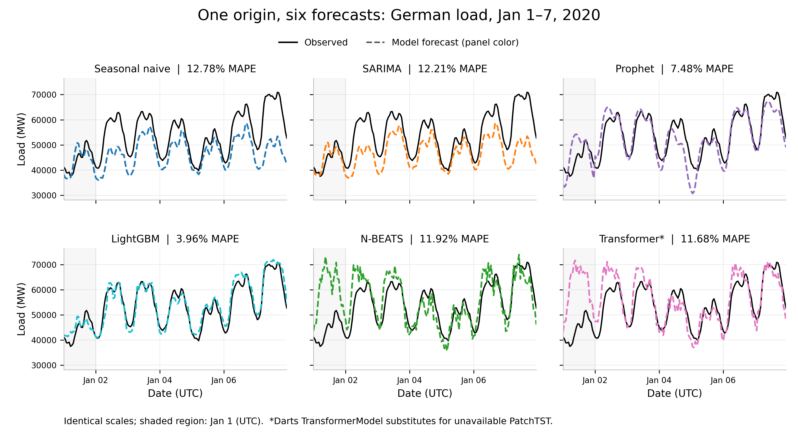

# German hourly load: a six-model forecasting bake-off

## 1. Data

Open Power System Data (OPSD), derived from the ENTSO-E Transparency Platform, supplies 50,400 national hourly load observations from 2015-01-01 00:00 to 2020-09-30 23:00 UTC, in megawatts. The CSV was checked against the complete hourly grid: no missing values, duplicate timestamps or gaps; no imputation was needed. No external observations were used. Calendar terms and German federal holidays are knowable from timestamps. Later 2020 observations appear only in the [overview](figures/01_overview.png).

## 2. Why these six models

Weekly seasonal naive anchors persistence; SARIMA adds daily residual dynamics after an explicit weekly difference; Prophet adds smooth trend, daily/weekly/yearly cycles and German holidays; LightGBM combines calendar features, 24/168/8,760-hour lags and strictly past 24/168-hour rolling means and standard deviations. N-BEATS tests a univariate residual MLP; a Darts encoder-decoder TransformerModel tests attention. **PatchTST is unavailable in Darts 0.41.0**, and TSMixer is not a transformer, so this is an explicit substitute, not a PatchTST result (`patchtst` is retained only as the requested machine key).

## 3. Validation strategy

Train has 41,616 hours through September 2019; validation has 2,208 hours (October–December). Initial coefficients/scalers use train only. Score 13 weekly blocks plus 24 hours, weighting hours equally. Earlier validation actuals update contexts/states, never coefficients. Prophet has no state update: its validation spans 1–92 days ahead, so compare validation scores only within models. Select between two SARIMA orders, two Prophet seasonality modes (priors fixed), and two LightGBM leaf counts. Custom all-origin MAPE early stopping selects 23 N-BEATS epochs and 12 transformer epochs (maximum 30, patience 5). Both have 168-hour inputs/outputs and training stride 168; N-BEATS retains default stacks. Freshly refit each selected configuration on all 43,824 pre-test hours, then forecast the complete test week without observed test lags. LightGBM loses 8,760 initial training targets to lag warmup, not source observations. Its calendar is Europe/Berlin; Prophet uses UTC holidays/cycles, with a local-midnight/DST limitation.

## 4. Results

| Model | MAPE (%) | RMSE (MW) | MAE (MW) | Jan 1 MAPE (%) | Jan 2–7 MAPE (%) | Fit/run (s) |
|:--|--:|--:|--:|--:|--:|--:|
| LightGBM | 3.96 | 2,457 | 2,042 | 5.82 | 3.65 | 7.1 |
| Prophet | 7.48 | 4,809 | 3,722 | 13.43 | 6.49 | 18.0 |
| Transformer* | 11.68 | 8,427 | 5,700 | 39.63 | 7.02 | 12.6 |
| N-BEATS | 11.92 | 8,395 | 5,855 | 38.61 | 7.47 | 26.9 |
| SARIMA | 12.21 | 8,603 | 6,954 | 5.48 | 13.33 | 14.3 |
| Seasonal naive | 12.78 | 8,809 | 7,238 | 6.52 | 13.82 | 0.0 |

*TransformerModel substitute. Jan 1 is a UTC-date subset; Jan 2–7 includes the weekend, not just working days. Errors are hour-weighted; MAPE = 100 × mean(|actual − forecast| / actual). RMSE and MAE retain MW. Ranking is a retrospective test comparison, not permission to tune on test. All forecasts and candidate scores are in `artifacts/`.*



Winner uncertainty: nominal **80% → 86.31% actual**; nominal **95% → 98.81% actual**. Pinball loss (MW): q0.1 **460.6**, q0.5 **1020.8**, q0.9 **378.2**. JSON coverage uses fractions. SARIMA uses Gaussian errors, Prophet predictive samples, and neural models five-quantile regression; naive has no native intervals. Points are medians except Prophet's `yhat` mean; its q0.5 is the sampled predictive median. LightGBM adds q0.025/q0.975 fits for 95% intervals; crossing correction preserves its median.

## 5. Discussion

LightGBM won at 3.96% MAPE, a 69.0% reduction relative to weekly persistence. Its Jan 1 error was 5.82%, compared with 3.65% over the remaining six days. LightGBM can combine annual load history, recent level and known calendar categories nonlinearly. That is a plausible explanation for its advantage, not a causal conclusion: no feature ablation was run, and split gain cannot establish which feature caused the improvement.

The holiday did not hurt every method most on Jan 1. Naive and SARIMA repeated the preceding Christmas week: Jan 2 inherited Dec 26, and Jan 7 inherited New Year's Eve. Their Jan 7 errors reached 24.7% and 24.6%. SARIMA's daily residual dynamics improved slightly on persistence but could not restore the post-holiday level. Prophet ranked second, yet its holiday term did not eliminate Jan 1 error (13.4%) or Saturday error (11.4%). A fixed additive calendar pattern does not capture every bridge-day or holiday interaction.

N-BEATS and the transformer overpredicted the holiday heavily, with Jan 1 MAPE of 38.6% and 39.6%. Neither receives an explicit holiday flag. The self-imposed sparse weekly-window schedule and short epoch budget also limit conclusions about well-tuned deep learning; measured runtime did not require this handicap. All five fitted models beat naive, but the ordering is not a general complexity ranking: two neural models were below Prophet and LightGBM, while classical weekly structure remained useful.

The winner's nominal 80% and 95% intervals covered 86.3% and 98.8% of test hours; its 80% band averaged 7,470 MW wide. These are conditional quantiles along one recursive median path, not full simulated trajectories. Smoother recursive predictions can shrink rolling variability. High coverage on one dependent, holiday-heavy week does not establish calibration, and it is not evidence of accuracy during the later 2020 demand disruption. Jan 6's regional holiday is deliberately absent from the federal calendar.

## 6. Recommendation

For a JRC short-term forecasting pilot, choose LightGBM as the provisional single candidate, not an already production-qualified model. Before deployment, freeze this configuration and evaluate many untouched rolling origins across seasons, holiday transitions and demand regimes; compare against persistence at each horizon; quantify skill uncertainty using week-level resampling; and calibrate intervals on separate historical origins. Audit timezone and regional-holiday handling, recursive-feature drift and operational latency. Weather may matter in production, but it was neither obtained nor used here: adding it would answer a different question from this deliberately temporal-only study.

## 7. Reproducibility note

From this directory, with the supplied venv, run:

```sh
../../.venv/bin/python code/forecast.py
../../.venv/bin/python -m unittest discover -s code -p 'test_*.py'
../../.venv/bin/python code/verify_study.py
```

No installs. `forecast.py` is the entry point; model modules are imported through its loader. Seed **20200101** covers Python, NumPy, LightGBM, Prophet and Torch; neural execution is deterministic CPU, four threads. Measured model-and-report wall time: **85.2 seconds (1.42 minutes)**, excluding development, review and cold-cache preparation. Per-model time includes selection/refit/prediction; total also includes model imports and figures. Versions, hashes, hardware, candidate scores and per-hour forecasts are in `artifacts/`. `--report-only` rebuilds figures without fitting. `training_attempt1.log` and `review.md` retain a corrected pre-scoring statsmodels memory-mode failure.

```text
Darwin Dermots-MacBook-Pro-2.local 25.5.0 Darwin Kernel Version 25.5.0: Mon Apr 27 20:41:12 PDT 2026; root:xnu-12377.121.6~2/RELEASE_ARM64_T6050 arm64
```

Python 3.12.13; Darts 0.41.0; Torch 2.10.0; LightGBM 4.6.0; statsmodels 0.14.6; Prophet 1.3.0; holidays 0.96.

Additional figures: [raw-labeled relative metrics](figures/03_metric_comparison.png), [per-day errors](figures/04_per_day_mape.png), [winner intervals](figures/05_winner_with_intervals.png), [residuals](figures/06_residuals.png), [LightGBM gain](figures/07_feature_importance.png), [Prophet components](figures/08_decomposition.png). Metric bars are normalized to naive = 1 so MW and percentages never share a raw numerical axis.
