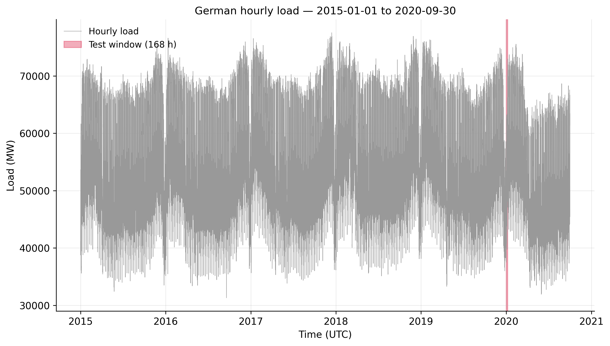
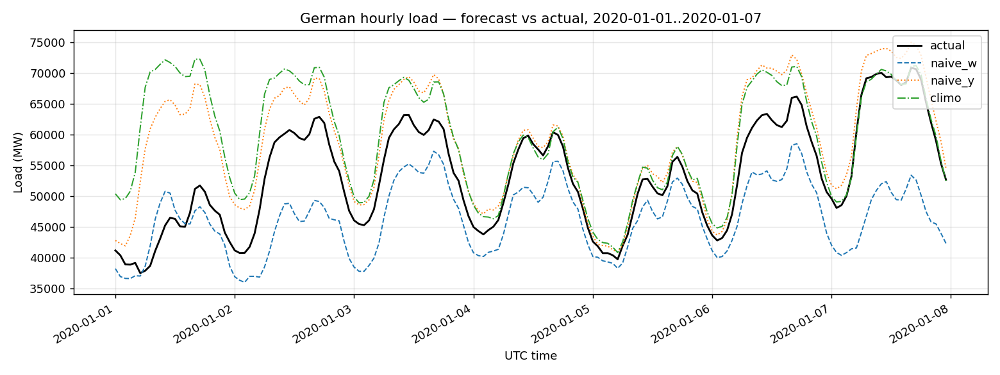
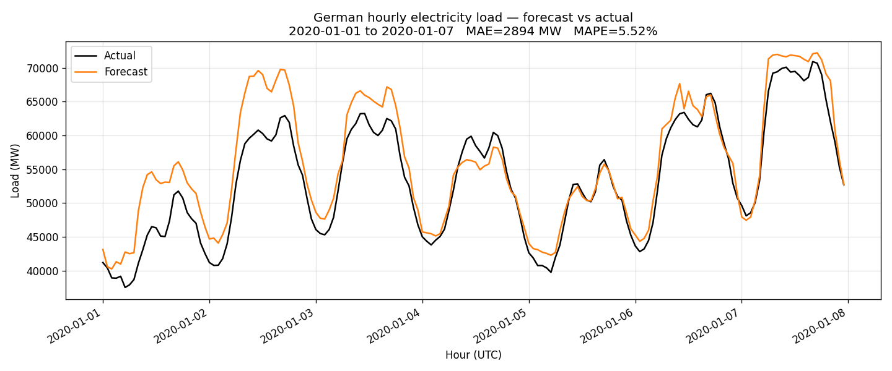
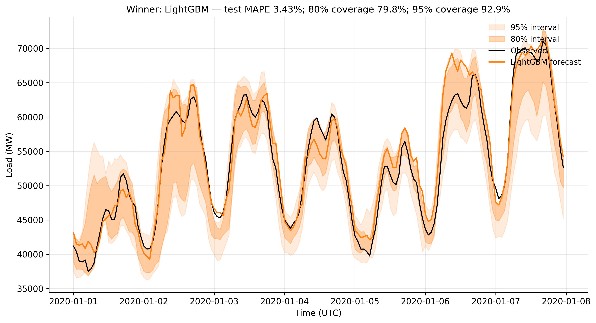
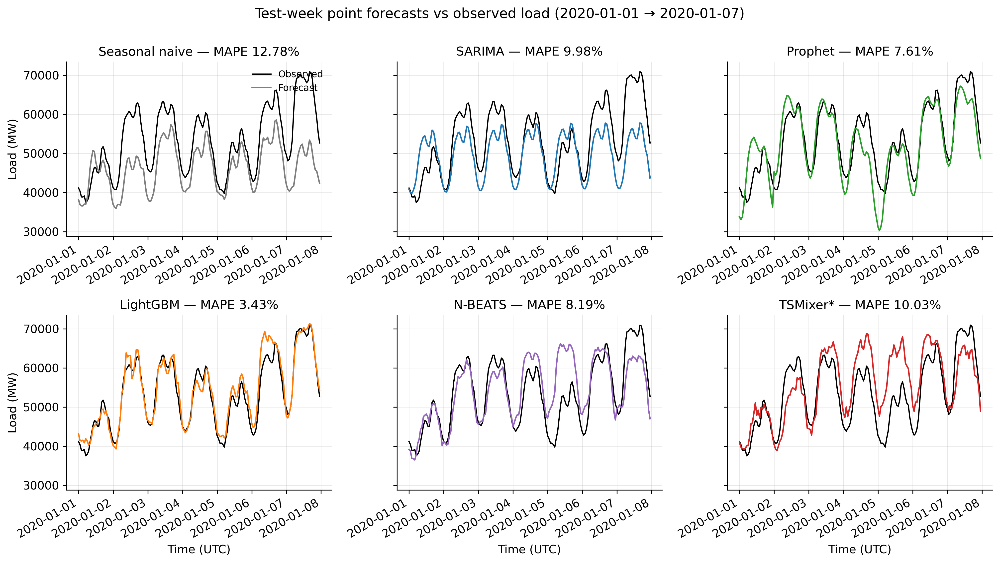
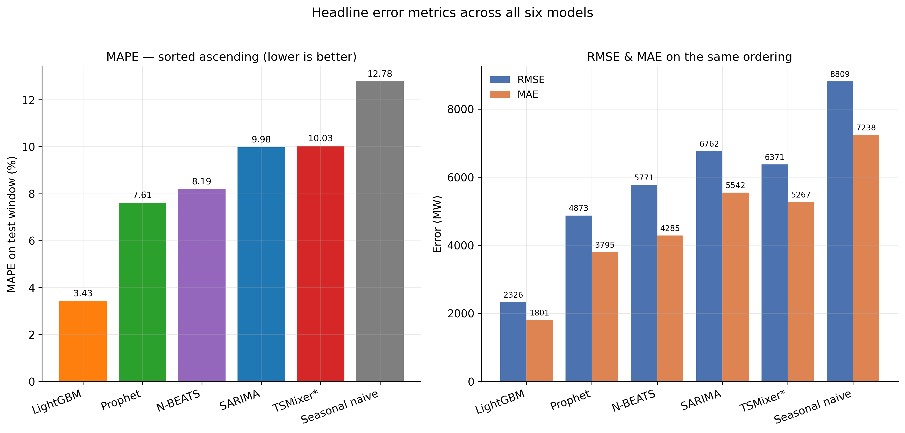
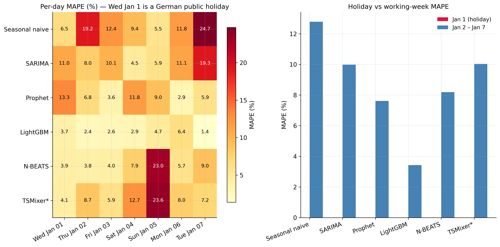
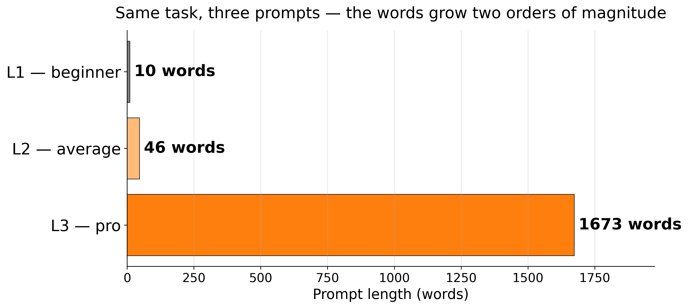

<!-- _paginate: false -->

<style scoped>
section { display: flex; flex-direction: column; justify-content: center; }
h1 { font-size: 54pt; margin-bottom: 0.2em; }
.subtitle { font-size: 28pt; color: #555; margin-bottom: 1em; }
.meta { font-size: 20pt; color: #888; margin-top: auto; }
</style>

# Prompt engineering, in practice

<div class="subtitle">Three users, one forecasting task,<br/>a factor-of-three in error</div>

<div class="meta">JRC C4 · Dermot O'Brien · 2026</div>

<!--
This is a 12-minute talk on how the way you write a prompt changes the result
of an AI-assisted forecasting task — by a factor of three, in our test.
Everything I'll show is reproducible from the repo linked at the end.
-->

---

# The headline

<div class="headline">
  <div class="col"><div class="num l1">10.76%</div><div class="lbl l1">L1 — beginner</div></div>
  <div class="col"><div class="num l2">5.52%</div><div class="lbl l2">L2 — average</div></div>
  <div class="col"><div class="num l3">3.43%</div><div class="lbl l3">L3 — pro</div></div>
</div>

<div class="caption">MAPE on a held-out 168-hour forecast of German hourly electricity load.<br/>Same data. Same target. Same AI agent (Claude Code, Opus 4.7).</div>

<!--
Same forecast task, same model agent, same data. The only thing that changed
across three runs was the prompt and the project context. The gap roughly
halves error each step — stay with these numbers, they anchor the whole talk.
-->

---

# The puzzle

<div style="margin-top: 100px; font-size: 48pt; font-weight: 600; text-align: center;">
What changed between these three runs?
</div>

<div class="caption" style="margin-top: 80px;">
Three things: the prompt itself · the project workspace · what we asked for as output.
</div>

<!--
Three forecasts diverged by a factor of three on the same data. There are
only three things that varied — the prompt, the workspace, and the requested
output. We'll see all three.
-->

---

# The task

- Forecast **168 hours** (one week) of hourly German electricity load
- Test window: **2020-01-01 to 2020-01-07** (held out)
- Training data: 2015-01-01 onward, hourly, ~50,000 rows
- Source: **Open Power System Data** / ENTSO-E
- Univariate: load series + features derivable from the timestamp

<!--
A real forecasting problem an economist or engineer in this unit might be
asked to solve. The test starts on a Wednesday which is also New Year's
Day — that detail will matter on the diagnostic slide.
-->

---

# The data



<!--
Five-and-three-quarter years of hourly load. The highlighted strip on the
right is the 168 hours every model was scored against. Strong weekly
seasonality and an annual swing — that's the structure all our models try
to learn.
-->

---

# Three personae

<div class="cards">
  <div class="card l1">
    <h3 class="l1">L1 — Beginner</h3>
    <div>Types one sentence into an AI tool. No project setup. No workspace file.</div>
    <div class="meta">Prompt: <b>10 words</b><br/>AGENTS.md: none</div>
  </div>
  <div class="card l2">
    <h3 class="l2">L2 — Average user</h3>
    <div>Has a Python project. Writes a thin AGENTS.md. Mentions the data file and the horizon.</div>
    <div class="meta">Prompt: <b>46 words</b><br/>AGENTS.md: 7 lines</div>
  </div>
  <div class="card l3">
    <h3 class="l3">L3 — Pro</h3>
    <div>Research-grade prompt. Rich AGENTS.md. Asks for validation, intervals, and a methods writeup.</div>
    <div class="meta">Prompt: <b>1,673 words</b><br/>AGENTS.md: 113 lines</div>
  </div>
</div>

<!--
Each persona is a real person you've met. Prompt specificity and workspace
setup tend to scale together — beginners don't have an AGENTS.md, pros do.
We made that scaling explicit in our test.
-->

---

# Three things that scale together

|              | Prompt                       | Workspace (AGENTS.md)           | Expected outputs                          |
|--------------|------------------------------|---------------------------------|-------------------------------------------|
| <span class="l1"><b>L1</b></span> | 10 words, one sentence       | (none)                          | (unspecified)                             |
| <span class="l2"><b>L2</b></span> | 46 words, names the horizon  | 7 lines: data file, libraries   | Forecast + plot + accuracy number         |
| <span class="l3"><b>L3</b></span> | 1,673 words, structured      | 113 lines: schema, do-nots      | 6-model bake-off, PIs, figures, transcript |

<div class="caption" style="margin-top: 30px;">
Three axes, all moving together. We'll unpack each row in the next three sections.
</div>

<!--
Three things move together when you become a more sophisticated AI user:
how specifically you write your prompt, how much project context you've set
up, and how rigorously you ask for the output. We'll unpack each.
-->

---

# L1 — the beginner's prompt

<div style="margin-top: 60px;">

> Forecast first week of January 2020 German hourly electricity load.

</div>

<div class="caption" style="margin-top: 60px;">
<b>10 words.</b> No project setup. No AGENTS.md. No method, no validation, no output format.
</div>

<!--
This is exactly what an economist new to AI tools would type. It tells the
model what but not how — no mention of method, validation, units, accuracy
target, or output format.
-->

---

# L1 — what the beginner got back



<div class="caption">
Three simple baselines. Best: <b>seasonal-naive (lag-364d), MAPE 10.76%</b>.<br/>
No transcript. No validation set. No prediction intervals.
</div>

<!--
The model did something sensible — three baselines and report the best. But
no validation discipline, no transcript explaining the choices, no honest
uncertainty. You'd accept this from an intern only because they didn't know
to do more.
-->

---

# L2 — the average user

<div class="twocol">
<div>

### The prompt (46 words)

```
Build me a Python script that
forecasts German hourly electricity
load for the first week of January
2020 (the 168 hours from
2020-01-01 to 2020-01-07).
Train on the historical data,
produce the forecast, plot it
against the actual values, and
tell me how accurate it was.
```
</div>
<div>

### AGENTS.md (7 lines)

```
# Notes for the AI

Python project. The file
opsd_de_load.csv has hourly
German load (MW) from OPSD.

Use pandas. Plot with matplotlib.
```
</div>
</div>

<!--
The L2 user knows enough to mention what they want produced and roughly
where the data lives. Crucially they don't specify the model, the validation
strategy, or what "accurate" means.
-->

---

# L2 — output



<div class="caption">
<b>GradientBoostingRegressor</b> with hand-engineered features (hour, DOW, lag-168h, lag-8760h).<br/>
<b>MAPE 5.52%.</b> Still no transcript, no held-out validation, no intervals.
</div>

<!--
The agent reached for what an experienced data scientist would reach for —
a tree model with calendar and lag features — without being told to. That's
not because the prompt was good; it's because the agent had some idea of
what's standard. You can't reliably count on that.
-->

---

# L3 — the pro's prompt structure

<div class="twocol">
<div>

### Prompt: 1,673 words

<div class="pattern-box task"><h3>TASK</h3><p>Forecast 168 hours. Six-model bake-off. Report MAPE / RMSE / MAE.</p></div>

<div class="pattern-box bg"><h3>BACKGROUND</h3><p>Data · Models · Allowed inputs · Splits · Metrics · Figures · Outputs</p></div>

<div class="pattern-box dont"><h3>DO NOT</h3><p>Use the test window for fitting. Pull external data. Skip refit-on-train+val. Drop missing hours silently.</p></div>

</div>
<div>

### AGENTS.md: 113-line workspace file

- Allowed / Forbidden inputs
- `code/`, `figures/`, `metrics.json` output layout
- `metrics.json` JSON schema
- `Do NOT` block
- Style: plain language, type hints, no emoji

</div>
</div>

<!--
This is what a researcher who's done this for a while writes. Three sections —
what to do, the context they'd need, and the explicit don'ts. The point
isn't the length; it's the structure. Anyone in this room can adopt it today.
-->

---

# L3 — the winner, with calibrated intervals



<div class="caption">
<b>LightGBM</b> on engineered features. <b>Test MAPE 3.43%.</b><br/>
80% PI covered 79.8% of points · 95% PI covered 92.9% — essentially nominal.
</div>

<!--
Winning model from a six-way bake-off the L3 prompt asked for. Test MAPE
3.43%. The shaded bands are 80% and 95% prediction intervals, and they
covered the observed values at 79.8% and 92.9% — that calibration is the
kind of thing you can never get from L1 because you never asked for it.
-->

---

# The bake-off — six models



<div class="caption">
Same train / validate / test splits. Same scoring window. One winner.
</div>

<!--
Six model classes — naive, SARIMA, Prophet, LightGBM, N-BEATS, and a
TSMixer stand-in for PatchTST. The prompt asked the agent to compare across
the methodology gradient. LightGBM on engineered features won by a margin.
-->

---

# The scoreboard



<div class="caption">
LightGBM wins MAPE, RMSE, and MAE simultaneously — and is faster than three of the other five.
</div>

<!--
LightGBM wins on every error metric and is mid-pack on runtime. The
seasonal-naive baseline is far worse than anything else, as it should be —
it's the honest floor.
-->

---

# Where each model fails — per-day MAPE



<div class="caption">
New Year's Day is the hardest day of the week. Only LightGBM stays uniformly low.
</div>

<!--
This is the most informative figure in the talk. Every model except
LightGBM has at least one badly-wrong day. Prophet has holiday handling but
learns the average federal holiday, not Jan 1 specifically. The deep models
nail Jan 1 and blow up on Sunday. Only LightGBM is uniformly low — and this
breakdown only exists because L3 explicitly asked for it.
-->

---

# What changed (1/4): the prompt itself



<div class="caption">
<b>Video tip 2 — be specific.</b> L3 isn't longer because the user is rambling;
it's longer because every dimension that matters is named.
</div>

<!--
Two orders of magnitude between L1 and L3 in prompt size. The lesson is
not "type more". L3 is longer because it specifies every dimension — task,
background, models, splits, metric, output structure, things not to do.
-->

---

# What changed (2/4): the project setup

<div class="cards">
  <div class="card l1">
    <h3 class="l1">L1 — AGENTS.md</h3>
    <div class="meta">(none)</div>
  </div>
  <div class="card l2">
    <h3 class="l2">L2 — AGENTS.md (7 lines)</h3>
    <div class="meta">Data file location · pandas + matplotlib</div>
  </div>
  <div class="card l3">
    <h3 class="l3">L3 — AGENTS.md (113 lines)</h3>
    <div class="meta">Allowed / Forbidden inputs · Output schema · metrics.json contract · Do-NOT block · Style</div>
  </div>
</div>

<div class="caption" style="margin-top: 40px;">
<b>Video tip 5 — tell the AI to remember.</b> AGENTS.md is read at the start of every
session. It's the single biggest leverage point most people miss.
</div>

<!--
AGENTS.md is the file every Claude Code session reads when it starts. L1
has none; L2 has a token AGENTS.md; L3 has a real one. Once you write this
file you stop re-explaining your project at the start of every session.
-->

---

# What changed (3/4): the DO NOT pattern

<div class="pattern-box task">
<h3>TASK</h3>
<p>What to do, precisely. The objective, the metric, the output shape.</p>
</div>

<div class="pattern-box bg">
<h3>BACKGROUND</h3>
<p>Data, files, constraints, references the model needs to do the task well.</p>
</div>

<div class="pattern-box dont">
<h3>DO NOT</h3>
<p>What to avoid. The cheapest, highest-leverage section of any prompt.</p>
</div>

<div class="caption" style="margin-top: 24px;">
<b>Video tip 4 — the DO NOT pattern.</b> Our L3 prompt has nine specific don'ts.
The one that mattered most: <i>do not use the test window for fitting.</i>
</div>

<!--
This pattern is borrowed from the video. The DO NOT section is the
cheapest, highest-leverage prompt change you can make. Our L3 had nine
don'ts including the one that protected the test split.
-->

---

# What changed (4/4): ask for verification

<div class="twocol">
<div>

### <span class="l1">L1</span>

No held-out validation set. No calibrated intervals. Reports test-set MAPE only.

The forecasts use only pre-test lags and climatology — there is no data leakage. Just no methodological discipline above what the agent thought to add unprompted.

</div>
<div>

### <span class="l3">L3</span>

Train (2015 → 2019-09-30) → validate (2019-10–12) → refit on train+val → forecast 2020-01-01..07.

80% PI covered **79.8%** · 95% PI covered **92.9%**. Essentially nominal.

</div>
</div>

<div class="caption" style="margin-top: 24px;">
<b>Video tip 7 — always verify.</b> Calibration doesn't happen by accident.
It happens because you asked.
</div>

<!--
Asking the AI to verify its own work isn't optional in research code. The
L3 prompt forced train/validate/test discipline and asked for explicit
interval coverage. The intervals came back essentially calibrated — that's
not a coincidence, it's because we asked.
-->

---

# So what — four habits

<div style="margin-top: 30px; font-size: 28pt; line-height: 1.5;">

1. **Specify what success looks like** — not just what to build.
2. **Use a DO NOT section** — including the obvious-but-easy-to-miss ones.
3. **Put standing context in `AGENTS.md`** — once, not every session.
4. **Make the AI verify itself** — backtest, intervals, written discussion.

</div>

<div class="caption" style="margin-top: 40px;">
Same four habits whether you're forecasting load, drafting a paper, or searching the literature.
</div>

<!--
These four habits produced our 3-to-1 accuracy gap. They take ten extra
minutes to apply per task; they save hours of re-running, re-validating, and
trusting bad output. Adopt them this week, not next quarter.
-->

---

<!-- _paginate: false -->

<style scoped>
section { display: flex; flex-direction: column; justify-content: center; align-items: center; }
.big { font-size: 80pt; font-weight: 700; margin-bottom: 0.2em; }
.sub { font-size: 32pt; color: #555; max-width: 900px; text-align: center; }
.credit { font-size: 18pt; color: #999; margin-top: 80px; font-style: italic; }
</style>

<div class="big l3">Your goal is leverage.</div>

<div class="sub">AI scales execution. Humans bring the ideas and the judgement.</div>

<div class="credit">after The Coding Sloth, 2025 · code &amp; data: github.com/DermotOBrien-EC/LLM_coding_example_jrc_andres</div>

<!--
This is the source video's closing line. Specificity in your prompts and
your project setup is what converts AI from a faster-typist into actual
leverage. Thank you.
-->
