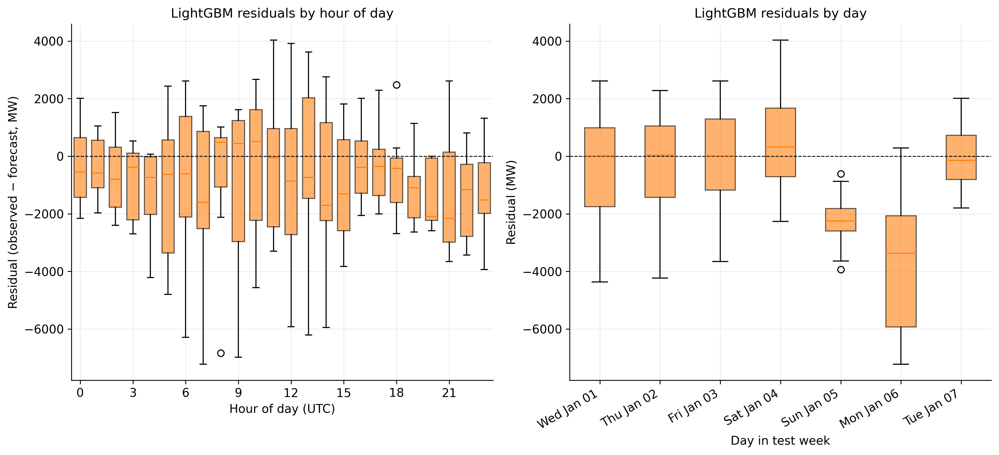
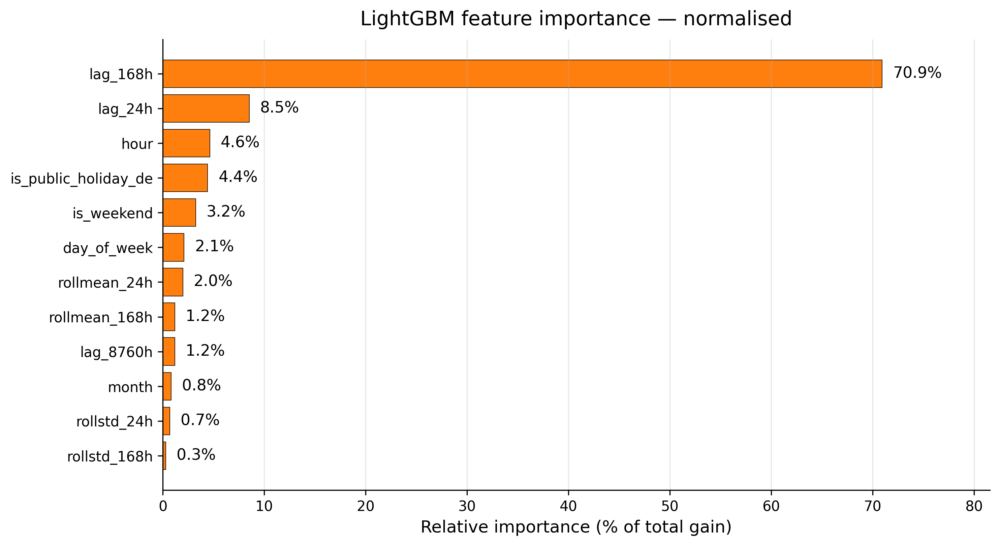
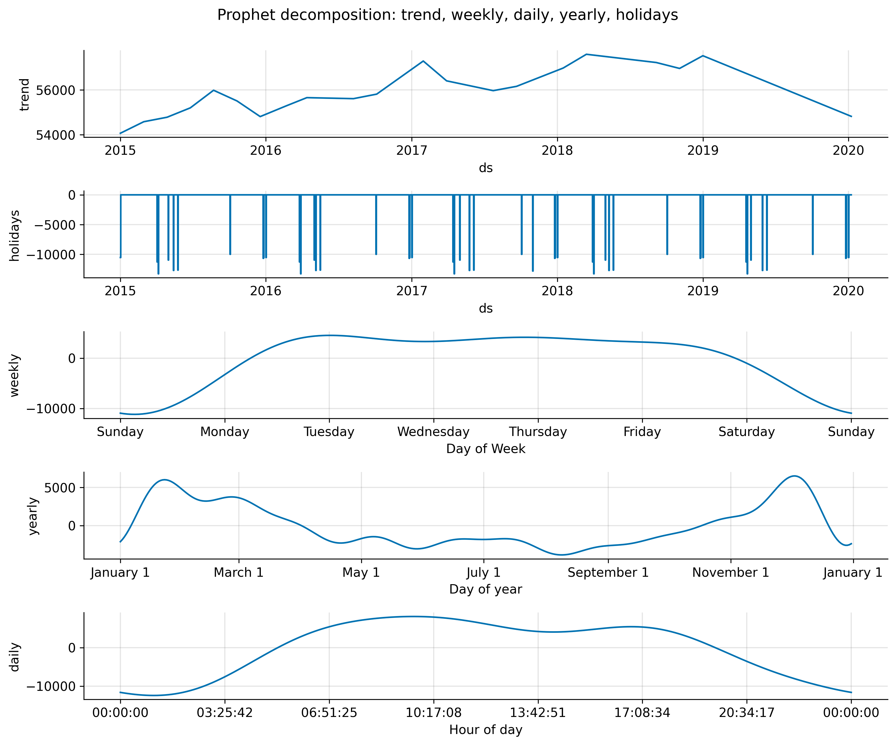

<!-- _paginate: false -->

<style scoped>
section { display: flex; flex-direction: column; justify-content: center; }
h1 { font-size: 48pt; margin-bottom: 0.25em; color: #1A3A6A; }
.subtitle { font-size: 26pt; color: #555; margin-bottom: 1em; }
.meta { font-size: 18pt; color: #888; margin-top: auto; }
</style>

# Seven tips for working with AI

<div class="subtitle">A field-tested playbook,<br/>illustrated with a forecasting experiment we ran in this unit.</div>

<div class="meta">JRC C4 · Dermot O'Brien · 2026 · after The Coding Sloth, 2025</div>

<!--
This talk borrows its structure from a 15-minute YouTube video by The Coding Sloth
("I Have Spent 500+ Hours Programming With AI", 2025). The seven tips come from
the video. The evidence for tip 2 — that prompt specificity is what determines
output quality — comes from a forecasting experiment we ran in-unit and which
this talk walks through in detail.
-->

---

<div class="tip-tag">TIP 1</div>

# Learn how to program first

<div style="margin-top: 22px; font-size: 24pt; line-height: 1.5;">

- AI is a **multiplier of what you already know.**
- It cannot replace the domain knowledge that an economist or engineer in C4 brings to a forecasting model, an impact assessment, or a policy briefing.
- If you don't know what "good" looks like for the task, no prompt will rescue you — you won't be able to tell when the output is wrong.

</div>

<div class="caption" style="margin-top: 24px;">
The rest of this talk is about how to convert your domain knowledge into AI output that's actually usable.
</div>

<!--
This is the obvious-but-foundational tip. In a JRC context: your value is the
domain expertise (energy, transport, climate). AI doesn't replace that — it
amplifies your throughput on tasks that surround the expertise (data cleaning,
plotting, drafting, literature search).
-->

---

<div class="tip-tag">TIP 2</div>

# Be as specific as humanly possible

<div style="margin-top: 12px; font-size: 24pt; line-height: 1.4;">

> AI is only as good as the context you give it.

</div>

<div style="margin-top: 20px; font-size: 22pt;">

- Most people don't give it enough.
- The next slides show <b>an experiment we ran in this unit</b> to quantify how much it matters.

</div>

<!--
The video proves this point with a "Google Docs clone" experiment. We replicate
the same shape — three increasingly specific prompts — but on a real forecasting
task you'd actually be asked to do in C4.
-->

---

# The experiment

<div style="margin-top: 16px; font-size: 22pt; line-height: 1.5;">

- **Task**: forecast 168 hours (one week) of hourly German electricity load, 2020-01-01 to 2020-01-07.
- **Data**: Open Power System Data (OPSD) / ENTSO-E, 2015–2020, hourly.
- **Agent**: Claude Code, Opus 4.7 — same agent in every run.
- **Three prompts**, three workspace setups:

</div>

<div class="level-cards">
  <div class="l1card">
    <h3 class="l1">Level 1 — beginner</h3>
    <div class="body">"Forecast first week of January 2020 German hourly electricity load."</div>
    <div class="meta">10 words · no AGENTS.md</div>
  </div>
  <div class="l2card">
    <h3 class="l2">Level 2 — average</h3>
    <div class="body">Names the data file, the horizon, the libraries. Asks for a plot and an accuracy number.</div>
    <div class="meta">46 words · 7-line AGENTS.md</div>
  </div>
  <div class="l3card">
    <h3 class="l3">Level 3 — research-grade</h3>
    <div class="body">Structured prompt (TASK / BACKGROUND / DO NOT). 6-model bake-off. Validation splits. Calibrated intervals. Written methods.</div>
    <div class="meta">1,673 words · 113-line AGENTS.md</div>
  </div>
</div>

<!--
Real, recognisable forecasting task. 168 hours = one week. The test window starts
on a Wednesday that is also New Year's Day — that detail will matter later.
-->

---

# Level 1 — what 10 words gets you

<div style="margin-top: 24px;">

> Forecast first week of January 2020 German hourly electricity load.

</div>


<div class="caption">
Three baselines compared; L1 picked the best of three: <b>seasonal-naive (lag-364d), MAPE 10.76%</b>.<br/>
No validation set. No prediction intervals. No methodology document.
</div>

<!--
The agent did something sensible — three calendar baselines and report the best
one. But no validation discipline, no transcript explaining the choices, no
honest uncertainty around the forecast.
-->

---

# Level 2 — the prompt and the workspace

<div class="twocol">
<div>

### The prompt (46 words)

```
Build me a Python script that
forecasts German hourly electricity
load for the first week of January
2020. Train on the historical data,
plot it against the actual values,
and tell me how accurate it was.
```

</div>
<div>

### AGENTS.md (7 lines)

```
# Notes for the AI
Python project. The file
opsd_de_load.csv has hourly
German load (MW) from OPSD.
Use pandas. Plot with matplotlib.
```

</div>
</div>

<!--
The L2 user knows enough to mention what they want produced and roughly where
the data lives. Crucially they don't specify the model, the validation
strategy, or what "accurate" means.
-->

---

# Level 2 — the result


<div class="caption">
The agent picked <b>GradientBoostingRegressor</b> with hand-engineered features (hour, day-of-week, lag-168h, lag-8760h).<br/>
<b>MAPE 5.52%.</b> Still no held-out validation, no prediction intervals, no methodology document.
</div>

<!--
The agent reached for what an experienced data scientist would reach for — a
tree model with calendar and lag features — without being told to. That's
because the agent had some idea of what's standard. You can't reliably count
on that.
-->

---

# Level 3 — the prompt structure (1,673 words)

<div class="pattern-box task"><h3>TASK</h3><p>Forecast 168 hours. Six-model bake-off. Report MAPE, RMSE, MAE.</p></div>

<div class="pattern-box bg"><h3>BACKGROUND</h3><p>Data · Allowed inputs · Train/validate/test splits · Metrics · Required figures · Output structure · AGENTS.md schema (113 lines)</p></div>

<div class="pattern-box dont"><h3>DO NOT</h3><p>Use the test window for fitting. Pull external data. Skip refit-on-train+val. Silently drop missing hours.</p></div>

<div class="caption" style="margin-top: 16px;">
Three sections. Same pattern for forecasting, paper drafting, literature search, debugging.
</div>

<!--
This is what a researcher who's been doing this for a while writes. Three
sections — what to do, the context they'd need, and the explicit don'ts. The
point isn't the length; it's the structure.
-->

---

# Level 3 — the result


<div class="caption">
LightGBM won a six-model bake-off. <b>MAPE 3.43%.</b><br/>
80% prediction interval covered <b>79.8%</b> of points; 95% covered <b>92.9%</b> — essentially nominal.
</div>

<!--
Test MAPE 3.43%. The shaded bands are 80% and 95% prediction intervals — and
they covered the observed values at 79.8% and 92.9% respectively. That
calibration is the kind of thing you can never get from L1 because you never
asked for it.
-->

---

# The headline isn't the MAPE — it's everything around it

<div class="level-cards" style="margin-top: 4px;">
  <div class="l1card">
    <h3 class="l1">L1 — beginner</h3>
    <div class="body" style="font-size:17pt;">
      <b>MAPE 10.76%</b><br/>
      3 baselines, picked best<br/>
      No validation set<br/>
      No prediction intervals<br/>
      No methods document<br/>
      1 figure<br/>
      Single script
    </div>
  </div>
  <div class="l2card">
    <h3 class="l2">L2 — average</h3>
    <div class="body" style="font-size:17pt;">
      <b>MAPE 5.52%</b> <i>(one model — got lucky)</i><br/>
      1 model: GradientBoostingRegressor<br/>
      No validation set<br/>
      No prediction intervals<br/>
      No methods document<br/>
      1 figure<br/>
      Single script
    </div>
  </div>
  <div class="l3card">
    <h3 class="l3">L3 — research-grade</h3>
    <div class="body" style="font-size:17pt;">
      <b>MAPE 3.43%</b> <i>(winner of a 6-model search)</i><br/>
      6 models compared systematically<br/>
      Held-out validation set (2019 Q4)<br/>
      80%/95% intervals — 79.8%/92.9% coverage<br/>
      Methods document (transcript.md)<br/>
      8 figures<br/>
      Orchestrator + per-model modules
    </div>
  </div>
</div>

<div class="caption" style="margin-top: 14px;">
L2 might have got lucky picking a decent model.<br/>
L3 didn't have to be lucky — it searched, validated, calibrated, and documented.
</div>

<!--
This is the real headline. The MAPE gap is one symptom of a much bigger
quality difference: project structure, code organisation, model search,
validation discipline, calibration, and a written record of what was tried.
L2's single-model choice happened to land on a decent algorithm; L3 didn't
need that luck because it searched the model space and proved the choice with
held-out validation.
-->

---

# Some of what L3 actually produced

<div class="fig-grid">
  <figure>
    
    <figcaption>Six-model forecast comparison</figcaption>
  </figure>
  <figure>
    
    <figcaption>Scoreboard — MAPE, RMSE, MAE</figcaption>
  </figure>
  <figure>
    
    <figcaption>Per-day MAPE heatmap</figcaption>
  </figure>
  <figure>
    
    <figcaption>Winner residuals by hour and day</figcaption>
  </figure>
  <figure>
    
    <figcaption>LightGBM feature importance (normalised)</figcaption>
  </figure>
  <figure>
    
    <figcaption>Prophet trend / seasonal decomposition</figcaption>
  </figure>
</div>

<div class="caption" style="margin-top: 10px; font-size: 14pt;">
Each figure was generated because the L3 prompt asked for it. L1 and L2 produced one figure each.
</div>

<!--
This is the visual punchline. L3 didn't just have a lower MAPE — it produced
the analytical diagnostics that let you trust the number. Six-model
comparison, sorted metrics, per-day breakdown, residual diagnostics, feature
importance, and a decomposition for the runner-up. The point isn't to read
any one figure — it's to show the volume and depth of what L3 produced
without any extra prompting beyond the structured prompt itself.
-->

---

<div class="subtip-tag">TIP 2 · SUB-TIP</div>

# Feed the AI what you'd Google

<div style="margin-top: 18px; font-size: 22pt; line-height: 1.5;">

- AI assistants can read the web. Don't make them guess what you already know how to look up.
- **Paste the docs.** API references, methodology papers, code examples — drop them into the prompt or attach them as files.
- **Use `llms.txt` pages.** Some libraries publish their docs in a format designed for LLMs; reference the URL.
- **Use screenshots.** Easier than describing a chart you want or a UI layout you have in mind.

</div>

<div class="caption" style="margin-top: 14px;">
This is the easiest 20-minute upgrade you can make to your prompts.
</div>

<!--
A C4 example: when asking AI to write an ENTSO-E download script, paste the
ENTSO-E Transparency Platform API documentation alongside the prompt. Don't
make the agent guess the endpoint structure.
-->

---

<div class="subtip-tag">TIP 2 · SUB-TIP</div>

# Have the AI improve your own prompt

<div style="margin-top: 18px; font-size: 22pt; line-height: 1.5;">

1. Write a rough draft prompt with all the technical information you have.
2. Paste it back to the AI and ask: <i>"Rewrite this prompt using LLM best practices for a structured task description."</i>
3. Review the rewrite. Keep what improves it, discard what's wrong.

</div>

<div class="caption" style="margin-top: 18px;">
A 30-second meta-step. Catches the structure-and-edge-case gaps you didn't think of.
</div>

<!--
This is the cheapest tip in the whole talk. It works because LLMs have seen
millions of well-structured prompts and can pattern-match yours to a better
version. The risk is the rewrite invents requirements you didn't intend — so
read it carefully.
-->

---

<div class="tip-tag">TIP 3</div>

# The smaller the task, the better the results

<div style="margin-top: 18px; font-size: 22pt; line-height: 1.5;">

- AI is good at small tasks. Worse at big, complex ones.
- Break a big task into smaller ones.
- <b>If you can't break it down, you don't understand the problem well enough yet.</b>
- This isn't an AI trick — it's fundamental engineering: plan the solution, decompose it, then code (or have AI code) each piece.

</div>

<div class="caption" style="margin-top: 18px;">
We did exactly this in our experiment — split into Phase 1 (run the three levels),<br/>Phase 2 (write the deck), with a plan-and-review step at every boundary.
</div>

<!--
Our experiment was orchestrated in phases. Phase 1 ran the three forecasting
agents. Phase 2 wrote this deck. Each phase had its own planning step (using
the /review-loop plan workflow) before any code was written.
-->

---

<div class="subtip-tag">TIP 3 · SUB-TIP</div>

# Let AI type for you — not think for you

<div style="margin-top: 24px; font-size: 24pt; line-height: 1.5;">

- Letting AI <b>type</b> the code or the prose for you is fine, even excellent.
- Letting AI <b>think</b> for you means you stop applying the skills that justify your role.
- The moment you outsource the decisions, the model's mistakes become invisible to you — because you've stopped having an opinion.

</div>

<div class="caption" style="margin-top: 18px;">
Plan the solution yourself. Read the output critically. Push back when it's wrong.
</div>

<!--
This connects back to Tip 1: AI multiplies what you bring. If you bring no
judgment, AI has nothing to multiply.
-->

---

<div class="tip-tag">TIP 4</div>

# Tell the AI what you <i>don't</i> want

<div style="margin-top: 12px; font-size: 22pt; line-height: 1.4;">

The single highest-leverage structural change to any prompt is to add a "DO NOT" block. The pattern:

</div>

<div class="pattern-box task"><h3>TASK</h3><p>What to do, precisely — the objective, the metric, the output shape.</p></div>
<div class="pattern-box bg"><h3>BACKGROUND</h3><p>The data, the files, the constraints, the references the model needs.</p></div>
<div class="pattern-box dont"><h3>DO NOT</h3><p>What to avoid — common mistakes, things that look right but aren't.</p></div>

<div class="caption" style="margin-top: 14px;">
Our Level 3 prompt had nine specific don'ts. The one that mattered most:<br/>
<i>do not use the test window for fitting.</i>
</div>

<!--
This is the cheapest, highest-leverage prompt change you can make. Especially
in research code where a single "don't peek at the test set" instruction
protects the validity of every downstream number.
-->

---

<div class="tip-tag">TIP 5</div>

# Tell the AI to remember — `AGENTS.md`

<div style="margin-top: 14px; font-size: 21pt; line-height: 1.45;">

- Every Claude Code session reads an `AGENTS.md` file at startup, if present.
- Put project standing context there <b>once</b>, not in every prompt: tech stack, file layout, data sources, conventions, things the agent should never do.
- Our experiment quantified the gap:

</div>

<div class="level-cards" style="margin-top: 10px;">
  <div class="l1card"><h3 class="l1">L1</h3><div class="body">No AGENTS.md.</div></div>
  <div class="l2card"><h3 class="l2">L2 — 7 lines</h3><div class="body">Data file location, libraries.</div></div>
  <div class="l3card"><h3 class="l3">L3 — 113 lines</h3><div class="body">Allowed/forbidden inputs · output schema · <code>metrics.json</code> contract · DO-NOT block · style rules.</div></div>
</div>

<div class="caption" style="margin-top: 12px;">
Single biggest leverage point most users miss.
</div>

<!--
Once you write this file, you stop re-explaining your project at the start of
every session. Critical for code where conventions matter (units, file layout,
naming) — i.e., almost all C4 modelling work.
-->

---

<div class="subtip-tag">TIP 5 · SUB-TIP</div>

# Have the AI draft `AGENTS.md` itself

<div style="margin-top: 18px; font-size: 22pt; line-height: 1.5;">

1. Point the agent at your existing codebase: <i>"Analyse this repository and propose an AGENTS.md."</i>
2. The agent reads the structure, infers conventions, drafts a v1.
3. You edit. Add the things it missed, remove the things it inferred wrongly.

</div>

<div class="caption" style="margin-top: 22px;">
Ten minutes' work. Saves hours of re-explaining your project for the rest of the year.
</div>

<!--
This is the most under-used tip in the whole video, in my view. Almost every
project benefits from a written AGENTS.md, and the marginal cost of having
the agent draft v1 is near zero.
-->

---

<div class="subtip-tag">TIP 5 · SUB-TIP</div>

# Reusable workflows — Skills

<div style="margin-top: 10px; font-size: 19pt; line-height: 1.4;">

- A **skill** is a named, reusable workflow you can invoke from the agent — a markdown file the agent reads when triggered.
- Lives in <code>~/.claude/skills/&lt;name&gt;/SKILL.md</code> (global) or <code>.claude/skills/&lt;name&gt;/SKILL.md</code> (project).
- We used one to build this deck: <code>/review-loop plan</code> / <code>/review-loop code</code> — codifies the plan-then-implement-then-review pattern.
- Heuristic: any workflow you do more than twice should be a skill. Sharable — drop a skill folder into a colleague's <code>.claude/skills/</code>.

</div>

<div class="caption" style="margin-top: 10px; font-size: 15pt;">
AGENTS.md gives the agent persistent <i>context</i>. Skills give it persistent <i>procedures</i>.
</div>

<!--
Skills are the second piece of the "tell AI to remember" puzzle. AGENTS.md is
*what this project is*. Skills are *how we work here*. The review-loop skill
we used to plan and implement this entire deck is the live example — every
non-trivial commit went through it.
-->

---

<div class="tip-tag">TIP 6</div>

# MCPs can extend what AI can do

<div style="margin-top: 16px; font-size: 21pt; line-height: 1.45;">

**MCP = Model Context Protocol.** Plug-in tools the agent can invoke at runtime.

A handful that are immediately useful for research code in C4:

- **Context7** — fetches up-to-date library documentation on demand. No more pasting docs into prompts.
- **Hugging Face MCP** — search models, datasets, papers; pull metadata.
- **GitHub MCP** — read repos, issues, PRs; useful when working across projects.

</div>

<div class="caption" style="margin-top: 16px;">
Find the MCPs that match your tech stack — there's probably one for every external system you touch.
</div>

<!--
We use Context7 routinely in this repo. The Hugging Face MCP is useful for
literature/methodology search. GitHub MCP is useful when reviewing PRs across
the various C4 repositories.
-->

---

<div class="tip-tag">TIP 7</div>

# Always give the AI a way to verify its work

<div style="margin-top: 14px; font-size: 21pt; line-height: 1.45;">

AI should never just write code. It also needs a way to <b>prove the code works.</b>

- **Tests** — unit, integration, regression.
- **A held-out validation set** for any model fitting.
- **Calibration metrics** — prediction interval coverage, residual diagnostics.
- **A written discussion of failure modes** — where it expects the model to break.

</div>

<div class="caption" style="margin-top: 14px;">
Our Level 3 prompt asked for all four. The 80%/95% prediction intervals came back<br/>covering <b>79.8%</b> and <b>92.9%</b> of observed points — essentially nominal coverage.
</div>

<!--
Calibration doesn't happen by accident. It happens because you asked for it.
The Level 1 agent could have produced intervals too — we just didn't ask.
-->

---

<div class="subtip-tag">TIP 7 · SUB-TIP</div>

# Have the AI generate the tests too — but verify them

<div style="margin-top: 18px; font-size: 22pt; line-height: 1.5;">

- The fastest way to get test coverage is to ask the agent to write the tests.
- The risk: AI-written tests can be tautological — they "pass" because they test the wrong thing.
- <b>Read every test it writes.</b> A failing test that catches a real bug is worth ten passing tests that don't.

</div>

<div class="caption" style="margin-top: 24px;">
Same principle for AI-written validation scripts, AI-written sensitivity analyses, AI-written everything.<br/>
Trust, then verify the trust.
</div>

<!--
This is a real failure mode. Especially with metric-based tests like
"validation MAPE should be under 5%" — the agent can hard-code the threshold
to whatever its current model achieves, making the test useless as a
regression guard.
-->

---

# Closing thesis — AI amplifies the habits you already have

<div style="margin-top: 30px; font-size: 24pt; line-height: 1.5;">

The seven tips are not really AI tips. They are <b>good engineering habits</b>:

- Be specific. Break the problem down. Tell collaborators what not to do.<br/>Write things down. Build verification in.

If you bring those habits, AI multiplies your throughput substantially.

If you don't — if you skip tests, skip docs, skip the "what could go wrong" question — AI amplifies <b>that</b> instead, faster than you can audit.

</div>

<div class="caption" style="margin-top: 14px;">
Be the kind of researcher whose habits AI is worth amplifying.
</div>

<!--
This is the source video's closing thesis, lightly reworded. It's the most
important slide in the deck — every concrete tip rolls up into this.
-->

---

<!-- _paginate: false -->

<style scoped>
section { display: flex; flex-direction: column; justify-content: center; align-items: center; }
.big { font-size: 80pt; font-weight: 700; margin-bottom: 0.2em; }
.sub { font-size: 30pt; color: #555; max-width: 900px; text-align: center; }
.credit { font-size: 17pt; color: #999; margin-top: 80px; font-style: italic; }
</style>

<div class="big l3">Your goal is leverage.</div>

<div class="sub">AI scales execution. You bring the judgement.</div>

<div class="credit">after The Coding Sloth, 2025 · code &amp; data: github.com/DermotOBrien-EC/LLM_coding_example_jrc_andres</div>

<!--
The source video's closing line. Specificity in your prompts and your project
setup is what converts AI from a faster-typist into actual leverage.
-->
